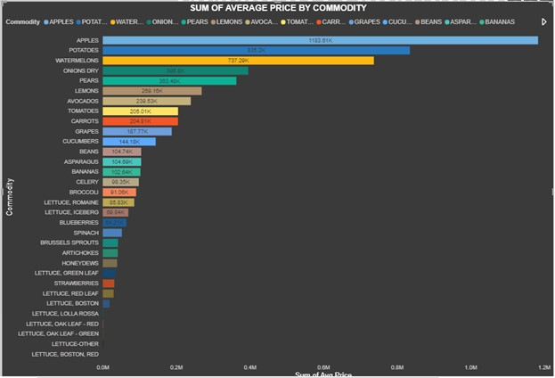
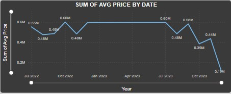
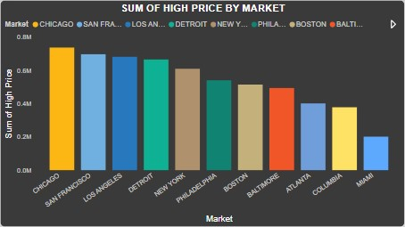
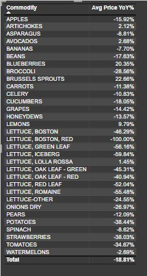

# Project1-USDA-Commodity-Price-Analysis

Executive Summary
This report analyzes key trends in the pricing data of fruits in different markets in the US. The focus areas include the sum of average price by commodity, sum of average price by date, price by market, and commodity by year-over-year (YoY) change. Notable trends include a downward trend in average prices over time and a negative YoY change for several commodities.

 
 

## Sum of Average Price by Commodity

 
Insight: This metric highlights the commodities with the highest and lowest average prices. It helps identify the most valuable commodities and those that may require pricing adjustments.
Example: Commodities like Apples have the highest average price ($1,183,611.03, accounting for 20.46% of the sum of Avg prices), indicate strong market demand or limited supply. Conversely, commodities like Lettuce Boston Red with the lowest average price ($192) may need strategic pricing reviews to enhance profitability.

## Sum of Average Price by Date

 
 
Insight: This data shows how the average price of commodities changes over 2 years. A downward trend suggests a general decrease in commodity prices.
Example: From 2022 to 2023, the average price of commodities has steadily decreased with a sharp drop in the last quarter of 2023, indicating potential market saturation or reduced demand. This trend necessitates a review of market strategies to address declining prices.

## High Price by Market

 
 
Insight: This metric compares the highest commodity prices across different markets, revealing regional price variations and potential opportunities for market expansion.
Example: San Francisco exhibit significantly higher prices compared to markets like Miami. This disparity suggests an opportunity to increase supply in rural areas to balance prices and maximize revenue

## Commodity by Year-over-Year (YoY) Change

 
 
Insight: This shows the percentage change in commodity prices compared to the previous year. A negative YoY indicates a decline in prices.
Example: Commodities like lettuce Boston Red with - 100% YoY change indicates their average prices have decreased by 100% compared to last year. This decline calls for an investigation into the underlying causes, such as changes in consumer behavior or economic factors.

## Key Trends
•	Downward Trend of Average Price by Date: The overall market prices for commodities are falling over time. This trend could be due to increased supply, reduced demand, or economic factors affecting purchasing power.
•	Negative YoY Change: A negative YoY change for multiple commodities suggests a broader market trend of declining prices. This could signal underlying issues such as economic downturns, increased competition, or shifts in consumer preferences.

## Actionable Insights
•	Adjust Pricing Strategies: Revise pricing strategies for commodities with significant price drops to maintain profitability.
•	Market Expansion: Explore opportunities in markets with higher prices to maximize revenue.
•	Supply Chain Optimization: Investigate supply chain efficiencies to reduce costs and counteract the impact of falling prices.

# Conclusion
The analysis of commodity price trends reveals critical insights into market dynamics. Addressing the downward trend in average prices and negative YoY changes requires strategic adjustments in pricing, market expansion, and supply chain optimization. These actions will help mitigate the impact of declining prices and enhance overall market performance.
